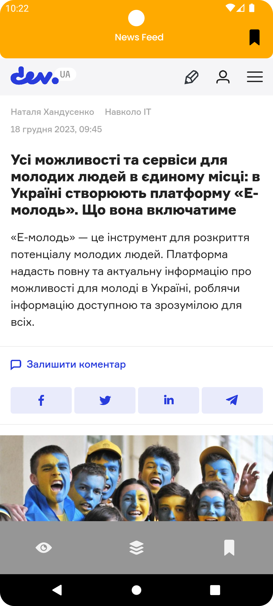

# Welcome to the News Feed Project!

Hello, I'm Andrii, and I'm excited to introduce you to the News Feed project.

## Tools & Technologies Used:

- Kotlin
- Android Framework
- Jetpack Compose
- Room database
- Retrofit
- Kotlin Flow
- Dagger Hilt DI
- DataStore
- Swipe and refresh
- WebView
- Clean architecture
- JUnit
- Espresso
- Database migration tests

This project aims to curate news feeds from five diverse sources: "The Guardian," "New York Times," "Fox News," "Sky Sports," and "Dev UA".

## Project overview:

### Initial Interface:
Upon opening the app, you'll encounter a window displaying all the latest news alongside a circular progress bar at the top, indicating that the app is fetching the most recent updates:

### Latest News Display:
Once the update process finishes, the news is displayed, sorted by published time, with the freshest stories showcased first:

### Navigation & Source Selection:
The app features a bottom navigation bar with three screens. The first screen, "All Feeds," is initially selected. The second screen showcases all available news sources in a disabled state:

To view news from a specific source, simply click on the source badge:

### Bookmarks Functionality:
Users can bookmark interesting articles by clicking on the bookmark icon:

Accessing bookmarked news is made easy through the third screen in the bottom navigation:

### Full News Viewing:
Clicking on a news article leads to a loading screen with a progress bar animation:

Once the article loads, it is displayed in full within the WebView:

### Bookmarks Management:
Users can remove a news item from bookmarks by tapping the bookmark icon in the top right corner:

Navigating back leads back to the bookmarks screen, where the removed news is no longer present:

### Key Features & Observations:
Apart from its primary functionalities, this app continuously monitors the device's internet connection. If the connection is lost, a corresponding message appears at the top of the screen:

Even without an internet connection, the app displays previously downloaded news stored locally. Upon reestablishing the connection, a notification prompts the user to update the news feed:

Clicking "Get latest news" initiates the update process:

Users can also employ swipe-to-refresh functionality for updating news.

This project had several interesting details:

- Complete utilization of Jetpack Compose
- Efficient data caching and a single source of truth approach
- Implementation of Kotlin Flows for aggregating news from multiple sources into a unified feed
- Testing database functionality along with migration

Thank you for your interest in my project. Feel free to explore the code and project structure. If you have any questions or suggestions, please don't hesitate to reach out!

My contacts:

[LinkedIn](https://www.linkedin.com/in/andrii-seleznov-32142721a/)

[Email](https://mail.google.com/mail/?view=cm&to=seleznov.andriy@gmail.com)